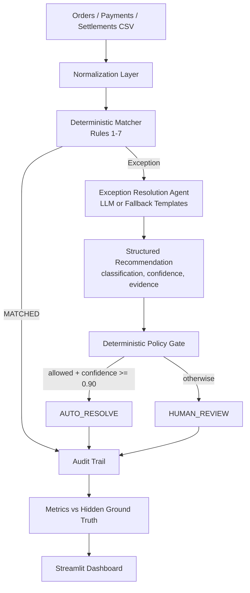

# ReconAI — AI Finance Controller

**Track 04: AI Finance Controller — Multi-Source Payment Reconciliation**
Built for the Razorpay AI Buildathon 2026 (2-hour build).

## 1. Problem

Merchants receive financial data from three disconnected systems — orders,
payment gateway transactions, and bank settlements — that disagree on IDs,
timestamps, and amounts (fees, delayed settlements, duplicates, reference
mismatches). Finance teams reconcile this by hand today.

## 2. Solution

ReconAI ingests all three sources, deterministically matches records,
routes anything ambiguous to an AI reasoning layer, and enforces a
policy gate that decides what can be auto-resolved versus what a human
must review — with a full audit trail and honest, batch-level metrics.

## 3. Why this matters to merchants

Manual reconciliation doesn't scale past a handful of transactions a day.
An agent that can safely clear 70–90% of a batch automatically, explain
every decision, and flag the genuinely ambiguous cases turns a multi-hour
manual task into a few seconds of automated processing plus a short,
prioritized human review queue.

## 4. Architecture



## 5. AI component

`src/exception_agent.py` implements the **Exception Resolution Agent**.
For every record the deterministic matcher couldn't cleanly resolve, the
agent produces a structured recommendation:

```json
{
  "classification": "AMOUNT_MISMATCH_EXPLAINED",
  "explanation": "...",
  "confidence": 0.97,
  "action": "AUTO_RESOLVE",
  "evidence": ["..."]
}
```

If `OPENAI_API_KEY` is set, the agent calls an LLM for the explanation and
classification. If not (or the call fails for any reason), it falls back
to deterministic explanation templates — the app works identically either
way, and the dashboard sidebar always shows which mode is active.

## 6. Guardrails (AI safety design)

The AI **never** writes to a financial record. It only proposes a
classification + confidence. A separate, deterministic **policy layer**
(`apply_policy` in `exception_agent.py`) is the only thing that can mark
something `AUTO_RESOLVE`, and only when:

1. The classification is in a fixed allow-list (`LIKELY_MATCH`,
   `AMOUNT_MISMATCH_EXPLAINED`, `REFERENCE_MISMATCH`), **and**
2. Confidence ≥ 0.90.

Everything else — regardless of what the AI recommends — is routed to
`HUMAN_REVIEW`. This means a mis-confident LLM call can never silently
close out a real discrepancy.

## 7. Dataset

`src/data_generator.py` generates a deterministic (seeded) synthetic batch
of orders, payments, and settlements (100 by default, minimum 50). It
intentionally injects the failure modes finance teams actually see:

| Category | Share | Ground truth label |
|---|---|---|
| Clean match | ~55% | `MATCHED` |
| Match after fee | ~20% | `MATCHED` |
| Amount mismatch | ~10% | `AMOUNT_MISMATCH` |
| Missing settlement | ~5% | `MISSING_SETTLEMENT` |
| Duplicate settlement | ~5% | `DUPLICATE` |
| Reference mismatch | ~3% | `REFERENCE_MISMATCH` |
| Ambiguous / unresolved | remainder | `UNRESOLVED` |

Ground truth is written to `data/ground_truth.csv` for **scoring only** —
it is never shown in the UI, only used to compute accuracy/FP/FN.

## 8. Reconciliation logic

Implemented in `src/matcher.py` as a strict rule hierarchy (first match
wins): exact payment ID + fee-adjusted amount → duplicate settlement rows
→ missing settlement → reference/amount/date proximity → amount mismatch
→ unresolved. See in-file docstring for the exact rule order.

## 9. Metrics

Computed in `src/metrics.py` against the hidden ground truth, over the
**entire batch**, not a cherry-picked example:

- Match rate, resolution rate, accuracy
- Auto-matched / auto-resolved / human-review / unresolved counts
- False positive count (wrongly auto-resolved) and false negative count
  (wrongly sent to review or missed)
- Processing time and throughput (records/sec)

## 10. Screenshots

_(Run the app and take screenshots here for your submission.)_

## 11. Installation

```bash
cd reconai
pip install -r requirements.txt
cp .env.example .env   # optional — leave OPENAI_API_KEY blank to use fallback mode
```

## 12. Running locally

```bash
streamlit run app.py
```

Then click **▶ Run Reconciliation** in the sidebar. The batch size and
random seed are adjustable; seed 42 reproduces the exact demo numbers
below.

## 13. Testing

```bash
pytest tests/ -v
```

Covers: exact match, fee-adjusted match, amount mismatch, missing
settlement, duplicate detection, unresolved/ambiguous records, the policy
gate's allow-list + confidence threshold, and end-to-end metric
calculation on a full batch.

## 14. Example output (seed=42, n=100)

```
Processed 100 records in ~0.12s (≈850 records/sec)
Match rate:        75.0%
Resolution rate:   78.0%
Accuracy:          100.0% (vs hidden ground truth)
Auto-resolved:     3
Human review:      19
Unresolved:        2
False positives:   0
False negatives:   0
```

## 15. Limitations

- Matching thresholds (₹1 exact, ₹5 "likely") are illustrative, not
  calibrated on real transaction data.
- The LLM path is a single best-effort call with no retries/streaming;
  fallback mode is the reliably-demoable path.
- No persistence layer — each run recomputes from scratch (by design,
  for a 2-hour MVP).

## 16. Future improvements

- Calibrate matching tolerances against real settlement data.
- Add a feedback loop where human review decisions retrain the confidence
  thresholds.
- Support multi-currency and partial settlements.
- Add a proper database + review queue with resolution workflow.

## 17. 3-minute demo script

1. **(30s)** Open the dashboard, point at KPI cards: "100 records, 75%
   auto-matched, 100% accuracy against a hidden ground truth."
2. **(45s)** Click **Run Reconciliation** live, show processing time and
   throughput — "under a second for 100 records."
3. **(45s)** Scroll to the exception table — "22 exceptions the
   deterministic engine couldn't resolve on its own."
4. **(45s)** Open a transaction detail — e.g. an `AMOUNT_MISMATCH` case —
   read the AI explanation and evidence out loud, show the confidence and
   the AUTO_RESOLVE / HUMAN_REVIEW split.
5. **(15s)** Open the audit trail expander — "every decision is logged
   and explainable, and we never let the AI touch the ledger directly —
   only a deterministic policy gate can approve an auto-resolution."
